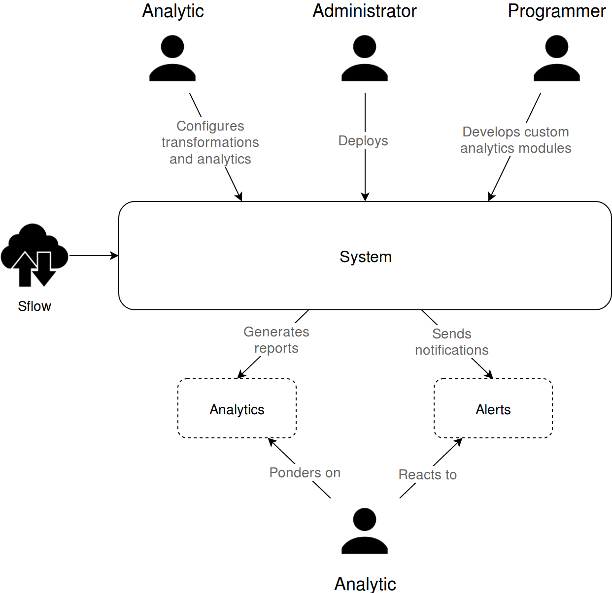
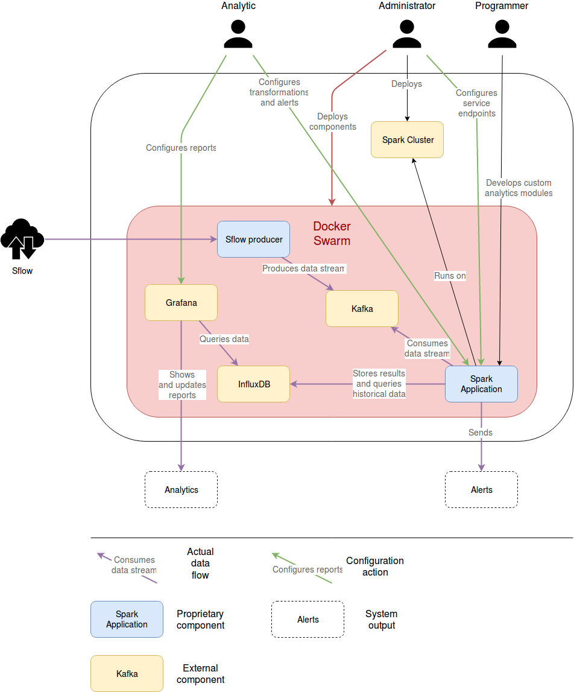
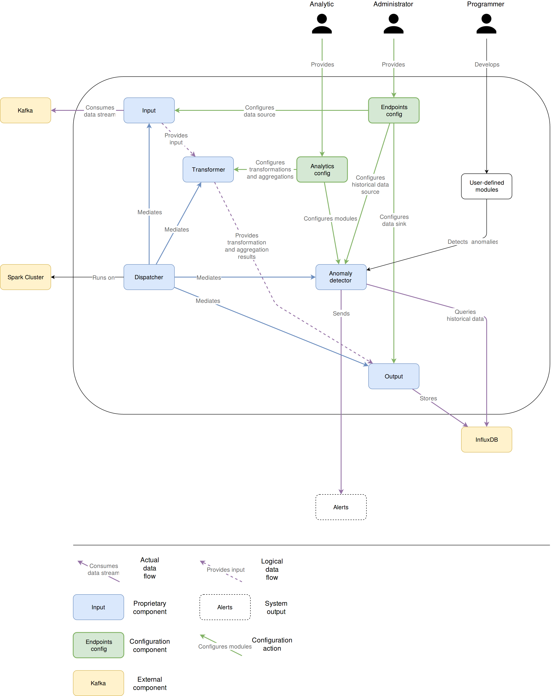
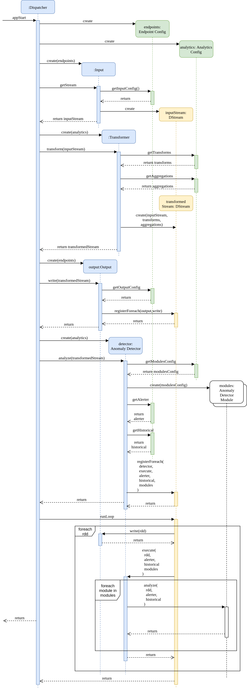

# Contents 
* [How to](#how-to)
  * [Add a diagram](#how-to-add)
  * [Alter a diagram](#how-to-alter)
  * [Merge changes to a diagram](#how-to-merge)
* [Diagrams](#diagrams)
  * [C4 Context Diagram](#c4-context)
  * [C4 Container Diagram](#c4-container)
  * [C4 Spark Application Component Diagram](#c4-spark)
  * [Spark Application Sequence Diagram](#sequence-spark)

# How to 

This section contains diagrams documenting the system.

Diagrams are created by draw.io web application and read-only copies of the diagrams are available for everyone.

## Adding a diagram 

If you want to add a new diagram, perform the following steps:

1. Create and edit a draw.io diagram.
1. Save it as xml and add the xml to this folder.
1. Export it to png and add the png to this folder. Make sure you use a high enough scaling ratio for the image to be crisp.
1. Name .xml and .png files identically.
1. Add a title, an anchor and a contents link for your diagram to the README file.
1. Insert the png image to the README file.
1. Add a "back to contents" link right after the image.

## Altering a diagram 

If you want to make changes to a diagram, perform the following steps:

1. Open the xml diagram file in draw.io web or desktop app.
1. Make necessary changes.
1. Save diagram as xml and export it to png (make sure you use a high enough scaling ratio for the image to be crisp), replacing both existing files.

## Merging changes 

Since a proprietary format is used, there is no easy way to merge changes to a single diagram.

If you encounter a confict while trying to alter a diagram xml, please restrain from overwriting someone elses diagram in your pull request.

## Deleting a diagram

If you want to delete a diagram, perform the following steps:

1. Delete .xml and .png files of the diagram.
1. Delete the title, the image and the link to the contents from the README file.
1. Delete the link to the diagram from the contents of the README file.

# Diagrams 

## C4 Context Diagram 

[Back to contents](#contents)

## C4 Container Diagram 

[Back to contents](#contents)

## C4 Spark Application Component Diagram

[Back to contents](#contents)

## Spark Application Sequence Diagram 

[Back to contents](#contents)